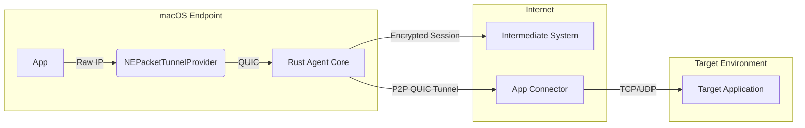

# Zero Trust Network Access (ZTNA) Agent - Architecture Design

## 1. System Overview
The system provides zero-trust network access by intercepting raw IP packets at the endpoint, encapsulating them in QUIC tunnels, and routing them through an intermediate NAT-traversal layer to a destination application connector.

**Core Components:**
1.  **Endpoint Agent (macOS)**: Intercepts raw packets, enforces policy, encapsulates in QUIC.
2.  **Intermediate System (Signaling/Relay)**: Facilitates Address Discovery (replacing STUN) and hole punching.
3.  **Application Connector**: Deployed near the target app (e.g., Docker sidecar), decapsulates traffic, forwards to localhost/LAN.

## 2. Component Design

### 2.1 Endpoint Agent (macOS)
- **Technology**: Swift (App/Extension container) + Rust (`quiche` via FFI).
- **Packet Interception**: `NEPacketTunnelProvider`.
    - Creates a virtual `utun` interface.
    - Assigned a virtual IP (CGNAT range, e.g., `100.64.0.1`).
    - Configured with "Include Routes" to capture traffic for specific secured subnets/domains.
- **Packet Processing (Rust Core)**:
    - **Library**: `quiche` (Cloudflare). Selected for its "sans-IO" model, allowing direct integration with the `NEPacketTunnelFlow` read loop without an async runtime overhead in the packet path.
    - **Logic**:
        1.  Read generic IPv4/IPv6 packet from `utun`.
        2.  Check policy (Allow/Deny).
        3.  Encapsulate payload into a QUIC `STREAM`.
        4.  Encrypt and send via physical socket.

### 2.2 Intermediate System (Signaling & Identity)
- **Role**: Replaces traditional STUN/TURN.
- **Functionality**:
    - **Address Discovery**: When Agent connects, Intermediate System observes the public IP:Port and sends it back via a custom `OBSERVED_ADDRESS` frame or standard QUIC `PATH_CHALLENGE`.
    - **Rendezvous**:Exchanges connection info between Agent and Connector to facilitate direct P2P connection (Hole Punching) where possible.
    - **Relay**: Fallback data relay if P2P fails.

### 2.3 Application Connector
- **Deployment**: Docker Container.
- **Role**: Reverse Proxy / Sidecar.
- **Logic**:
    - Dial out to Intermediate System to listen for incoming Agent connections.
    - On connection, accept QUIC stream, decapsulate data, forward to configured Dest IP:Port.

## 3. Implementation Details - MVP Phase

### 3.1 "Hello World" MVP Goal
Authenticate the ability to intercept and modify packets on macOS using the proposed stack.

### 3.2 MVP Stack
- **Language**: Swift (Wrapper), Rust (Core Logic).
- **Core Library**: `quiche`.
- **Target OS**: macOS 14+ (Sonoma).

### 3.3 MVP Architecture
1.  **Host App**: Simple SwiftUI app to install/start the system extension.
2.  **Network Extension**: `NEPacketTunnelProvider`.
3.  **Rust Handler**:
    - Compiled as a static library (`libagent.a`).
    - Exposes a C-compatible FFI for QUIC agent lifecycle (see `PacketProcessor-Bridging-Header.h`).
4.  **Flow**:
    - Extension starts -> sets up `10.0.0.1` tunnel.
    - `packeflow.readPackets` -> passes data to Rust.
    - Rust parses headers (using `etherparse` crate) -> logs "Saw TCP packet to 1.1.1.1".
    - Rust returns `DROP` or `FORWARD`.
